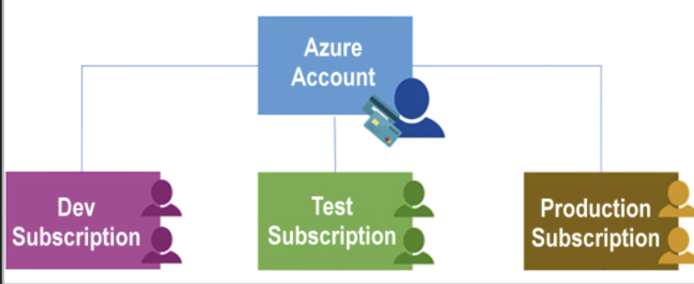

# Azure management infrastructure

- The management infrastructure includes:  
    - resources and resource groups 
    - subscriptions
    - accounts

## Azure resources and resource groups

- A resource is the basic building block of Azure. 
- Anything you create, provision, deploy, etc. is a resource
- for example Virtual Machines (VMs), virtual networks, databases, cognitive services, etc.
- Resource groups are simply groupings of resources

## Azure subscriptions and accounts

- 1 account -> N subscriptions
- In Azure, subscriptions are a unit of management, billing, and scale. 
- A subscription provides you with authenticated and authorized access to Azure products and services
- Similar to how resource groups are a way to logically organize resources, subscriptions allow you to logically organize your resource groups and facilitate billing.
- An Azure subscription links to an Azure account, which is an identity in Microsoft Entra ID or in a directory that Microsoft Entra ID trusts
- An account can have multiple subscriptions 
- Azure generates separate billing reports and invoices for each subscription so that you can organize and manage costs.
- you can seperate subscriptions by Environments, Organizational structures, Billing

## Azure management groups

