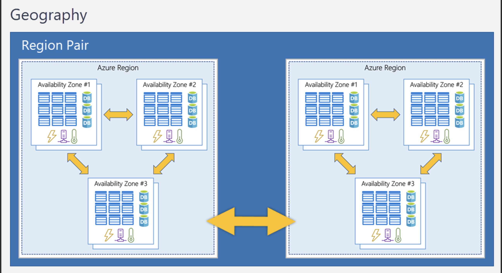

# Availability Zones

- Availability zones are physically separate datacenters within an Azure region

- Availability zones are primarily for VMs, managed disks, load balancers, and SQL databases. Azure services that support availability zones fall into three categories:

- Zonal services: You pin the resource to a specific zone (for example, VMs, managed disks, IP addresses).
- Zone-redundant services: The platform replicates automatically across zones (for example, zone-redundant storage, SQL Database).
- Non-regional services: Services are always available from Azure geographies and are resilient to zone-wide outages as well as region-wide outages.

# Region pairs

- Most Azure regions are paired with another region within the same geography (such as US, Europe, or Asia) at least 300 miles away

Additional advantages of region pairs:
- If an extensive Azure outage occurs, one region out of every pair is prioritized to make sure at least one is restored as quickly as possible for applications hosted in that region pair.
- Planned Azure updates are rolled out to paired regions one region at a time to minimize downtime and risk of application outage.
- Data continues to reside within the same geography as its pair (except for Brazil South) for tax- and law-enforcement jurisdiction purposes.

# Sovereign Regions

- Sovereign regions are instances of Azure that are isolated from the main instance of Azure. 
- You may need to use a sovereign region for compliance or legal purposes.