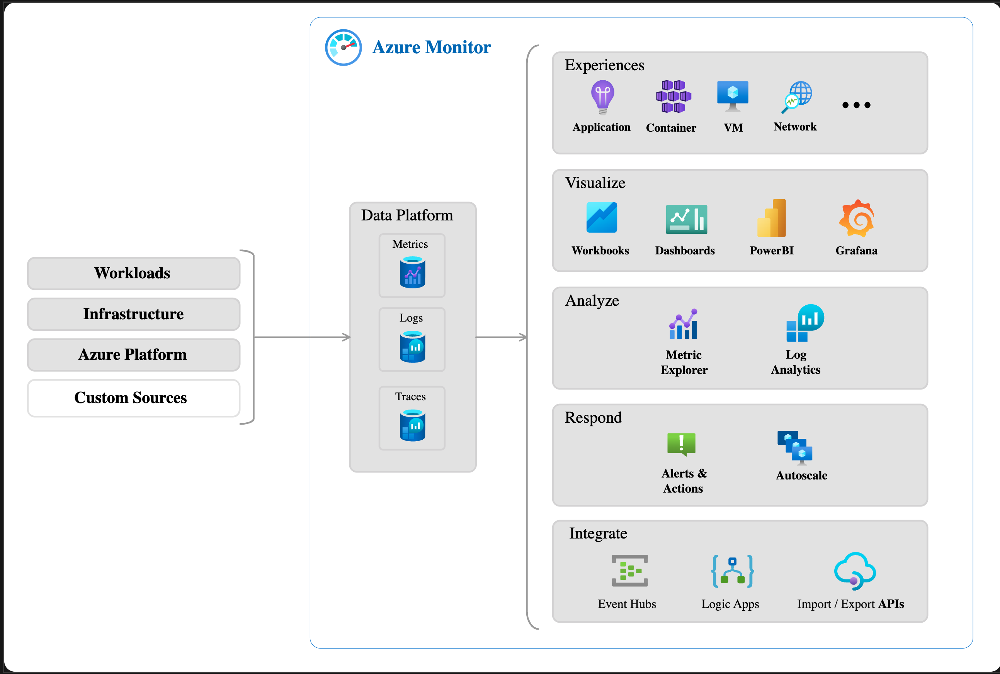

# Azure Monitor

- Azure Monitor ist eine Plattform für das Sammeln von Daten zu Ihren Ressourcen, die Analyse dieser Daten, die Visualisierung der Informationen und sogar die Reaktion auf die Ergebnisse

- überwacht Azure-Ressourcen, lokale Ressourcen und sogar Multi-Cloud-Ressourcen wie virtuelle Computer überwachen, die bei einem anderen Cloudanbieter gehostet werden.

 