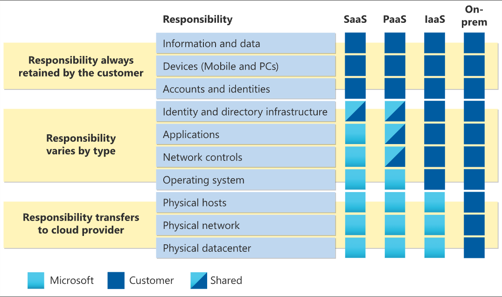
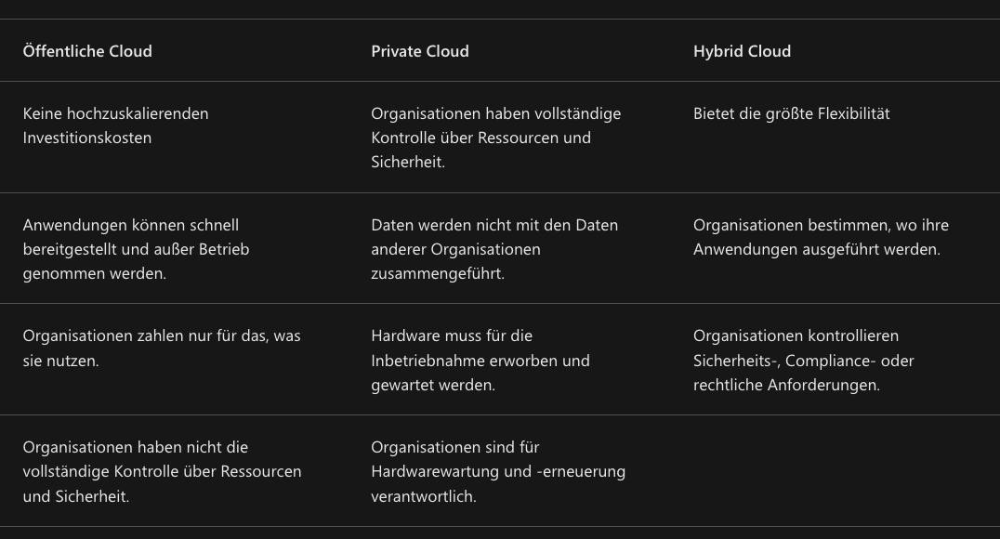

# MS Azure Fundamentals

## Basics - Cloud-Computing

1. Compute Power (CPU, RAM) easily scalable
2. Storage 
3. Automatic Backups of Storages
4. Automated Updates of OS
5. Taking care of Availability 

## Shared Responsibility-Modells
- Modell der gemeinsamen Verantwortung
- Mit Cloud Computing verschieben sich Verantwortlichkeiten
- Verantwortlichkeiten werden zwischen dem Cloudanbieter und dem Benutzer verteilt. Mit einem lokalen Rechenzentrum sind Sie für alles verantwortlich
- Der Cloudanbieter ist verantwortlich für die physische Sicherheit, den Strom, die Kühlung und die Netzwerkkonnektivität
- Der Benutzer oder die Benutzerin hat nichts mit dem Rechenzentrum zu tun
- Gleichzeitig ist der Benutzer oder die Benutzerin für die Daten und Informationen verantwortlich, die in der Cloud gespeichert werden
- Zusätzlich hängt die Verantwortung für einige Dinge von der Situation ab. 
    - Wenn Sie eine SQL-Clouddatenbank verwenden, ist der Cloudanbieter für die Verwaltung der tatsächlichen Datenbank verantwortlich
- Wenn Sie einen virtuellen Computer bereitgestellt und eine SQL-Datenbank darauf installiert haben, sind Sie für Datenbankpatches und -updates verantwortlich, sowie für die Verwaltung der Daten und Informationen, die in der Datenbank gespeichert sind
- Verantwortlichkeiten sind von Clouddiensttypen abhängig. Siehe Graphik

Wenn Sie einen Cloudanbieter verwenden, sind Sie immer für Folgendes verantwortlich:

- Die Informationen und Daten, die in der Cloud gespeichert sind
- Geräte, die eine Verbindung mit Ihrer Cloud herstellen dürfen (Mobiltelefone, Computer usw.)
- Die Konten und Identitäten der Personen, Dienste und Geräte innerhalb Ihrer Organisation

Der Cloudanbieter ist für Folgendes verantwortlich:

- Das physische Rechenzentrum
- Das physische Netzwerk
- Die physischen Hosts

Ihr Servicemodell bestimmt die Verantwortung für Dinge wie:

- Betriebssysteme
- Netzwerksteuerungen
- Anwendungen
- Identität und Infrastruktur

## Grundlegendes zu Cloudmodellen (Private, Public, Hybrid)

### Private Cloud
Beginnen wir mit einer privaten Cloud. Eine private Cloud ist in gewisser Hinsicht die natürliche Entwicklung des Rechenzentrums eines Unternehmens. Es handelt sich um eine Cloud (Bereitstellung von IT-Diensten über das Internet), die von einer einzelnen Entität verwendet wird. Private Cloud bietet viel mehr Kontrolle für das Unternehmen und seine IT-Abteilung. Diese Infrastruktur verursacht jedoch auch höhere Kosten und bietet weniger Vorteile als die Bereitstellung einer öffentlichen Cloud. Eine private Cloud kann schließlich auch von Ihrem lokalen Rechenzentrum gehostet werden. Sie kann auch in einem dedizierten Rechenzentrum außerhalb gehostet werden, möglicherweise sogar von einem Drittanbieter, der über ein dediziertes Rechenzentrum für Ihr Unternehmen verfügt.

### Öffentliche Cloud
Eine öffentliche Cloud wird von einem Drittanbieter erstellt, kontrolliert und verwaltet. Mit einer öffentlichen Cloud können alle Personen, die Clouddienste erwerben möchten, auf Ressourcen zugreifen und diese verwenden. Die allgemeine öffentliche Verfügbarkeit ist ein wichtiger Unterschied zwischen öffentlichen und privaten Clouds.

### Hybrid Cloud
Eine Hybrid Cloud ist eine Computerumgebung, die sowohl öffentliche als auch private Clouds in einer miteinander verbundenen Umgebung verwendet. Eine Hybrid Cloud-Umgebung kann verwendet werden, um eine private Cloud für erhöhte, temporäre Nachfrage zu ermöglichen, indem öffentliche Cloudressourcen bereitgestellt werden. Hybrid Cloud kann verwendet werden, um eine zusätzliche Sicherheitsebene bereitzustellen. Benutzer*innen können z. B. flexibel auswählen, welche Dienste in der öffentlichen Cloud beibehalten werden sollen und welche für ihre private Cloudinfrastruktur bereitgestellt werden sollen.

## Azure Arc (Unified Management System)
Azure Arc umfasst eine Reihe von Technologien, die Ihnen dabei helfen, Ihre Cloudumgebung zu verwalten. Azure Arc kann Ihnen dabei helfen, Ihre Cloud-Umgebung, sei diese öffentlich oder ausschließlich in Azure, eine private Cloud in Ihrem Rechenzentrum, zudem eine Hybridkonfiguration oder sogar eine Multi-Cloud-Umgebung, die auf mehreren Cloudanbietern gleichzeitig ausgeführt wird, zu verwalten.

Ähnliche Systeme sind:
- Multi-Cloud Management System (MCMS)
- Hybrid Cloud Management System (HCMS)
- Cloud Management Platform (CMP)
- Infrastructure Management System

## Azure VMware Solution (Umzug von VMWares)
Was passiert, wenn Sie bereits eine VMware-Instanz in einer privaten Cloudumgebung eingerichtet haben, jedoch in eine öffentliche Cloud oder Hybrid Cloud wechseln möchten? Mit Azure VMware Solution können Sie Ihre VMware-Workloads in Azure mit nahtloser Integration und Skalierbarkeit ausführen.

## Verbrauchsbasiertes Modells

Beim Vergleich von IT-Infrastrukturmodellen müssen zwei Arten von Ausgaben berücksichtigt werden: 
- Investitionsausgaben (CapEx) und
- Betriebskosten (OpEx).

### CapEx (Investitionsausgaben)
- einmalige Kosten, die vorab für den Kauf oder zur Sicherung materieller Ressourcen anfallen

### OpEx (Laufende Ausgaben)
- Ausgaben, die kontinuierlich für Dienste oder Produkte anfallen
- Cloud Computing fällt in die Kategorie OpEx

**Beim Cloud Computing fallen für die physische Infrastruktur, Strom, Sicherheit oder andere Wartungsaspekte eines Rechenzentrums KEINE Kosten an!**
Stattdessen bezahlen Sie für die IT-Ressourcen, die Sie verbrauchen.

#### OpEx für eigenen Rechenzentrum

**a) Personal**
- **Technisches Personal**:
  - Rechenzentrumsmanager, Netzwerkadministratoren, IT-Support, Sicherheitspersonal.
  - Typischer Bedarf: 10–20 Mitarbeiter.
  - Durchschnittliche Gehälter (Europa): 50.000–80.000 € pro Person/Jahr.
  - Kosten: **500.000–1,6 Mio. € jährlich**.
- **Reinigung und Facility Management**:
  - Externe Dienstleister oder internes Personal.
  - Kosten: 50.000–100.000 € jährlich.

 **b) Energieverbrauch**
- **Strom für IT-Geräte**:
  - Durchschnittliche Energieeffizienz (PUE-Wert): 1,5–2,0.
  - Für ein Rechenzentrum mit 1 MW IT-Last: 1,5–2 MW Gesamtenergiebedarf.
  - Strompreis (Europa): 0,20 €/kWh.
  - Jährliche Kosten: **2,6–3,5 Mio. €**.
- **Kühlung**:
  - Bestandteil des PUE-Wertes, aber separater Kostenfaktor für Klimaanlagen, Kühlmittel etc.
  - Zusätzliche Wartungskosten: 50.000–100.000 € jährlich.

 **c) Wartung und Ersatzteile**
- **Infrastrukturwartung**:
  - Regelmäßige Inspektionen und Wartung der Klimaanlage, USV-Systeme, Generatoren.
  - Kosten: 100.000–300.000 € jährlich.
- **Hardware-Austausch**:
  - Erneuerung von Servern, Speichern und Netzwerktechnik alle 3–5 Jahre.
  - Jährliche Rückstellungen: 200.000–500.000 €.

 **d) Netzwerk- und Internetkosten**
- **Laufende Anbindungskosten**:
  - Je nach Bandbreite und Provider.
  - Kosten: 50.000–200.000 € jährlich.

 **e) Software und Lizenzen**
- Monitoring- und Management-Software, Betriebssysteme, Sicherheitssoftware.
  - Kosten: 50.000–200.000 € jährlich.

 **f) Versicherung und Steuern**
- Versicherung gegen Feuer, Ausfälle, Diebstahl.
  - Kosten: 50.000–100.000 € jährlich.

**Gesamt ca. 4,5–7,4 Mio. €**

#### OpEx für MS Azure Services

Abhängig von Faktoren wie:

- Ressourcentyp
  -  Wenn Sie eine Azure-Ressource bereitstellen, erstellt Azure Verbrauchseinheiten für diese Ressource. Die Verbrauchseinheiten verfolgen den Verbrauch der Ressource nach und generieren einen Verbrauchsdatensatz, der für die Erstellung Ihrer Abrechnung verwendet wird.
- Nutzung
  - Usage: Bei diesem Zahlungsmodell in der Cloud bezahlen Sie für die Ressourcen, die Sie während eines Abrechnungszyklus verwenden. Wenn Sie in einem Zeitraum mehr Computeressourcen nutzen, zahlen Sie mehr. Wenn Sie im aktuellen Zeitraum weniger Computeressourcen verwenden, zahlen Sie weniger. Dieses übersichtliche Abrechnungsverfahren bietet maximale Flexibilität.
  - Azure bietet jedoch auch die Möglichkeit, im Voraus eine bestimmte Menge von Cloudressourcen festzulegen und Rabatte für diese „reservierten“ Ressourcen zu erhalten. Viele Dienste, einschließlich Datenbanken, Compute und Speicher, bieten die Möglichkeit, einen bestimmten Verbrauchsumfang festzulegen und dafür einen Rabatt zu erhalten – in einigen Fällen bis zu 72 %.
- Wartung
  - Die Verwendung von Ressourcengruppen kann dazu beitragen, alle Ihre Ressourcen optimal zu organisieren.
- Gebiet
- Abonnementtyp
- Azure Marketplace

## Hochverfügbarkeit und Skalierbarkeit in der Cloud

### Hochverfügbarkeit

#### Azure SLAs

- Up-Time
   - 99% = 7,2 Std down pro Monat (Hours down per month)
   - 99,9% = 43,2 min down pro Monat (Minutes down per month

### Zuverlässigkeit

- Zuverlässigkeit ist die Fähigkeit eines Systems, nach Ausfällen eine Wiederherstellung durchzuführen und die Betriebsbereitschaft sicherzustellen. Sie ist auch eine der Säulen des Microsoft Azure Well-Architected Framework.

## Sicherheit und Governance in der Cloud
- Cloudfeatures unterstützen Governance und Compliance
