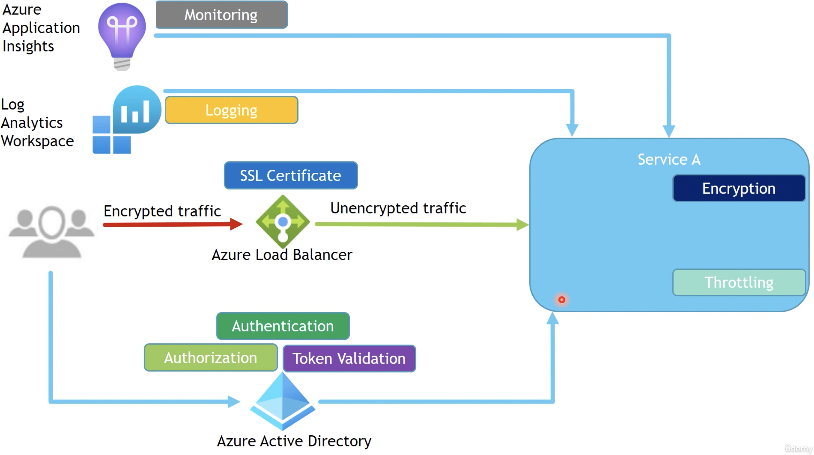

# Cloud Deign Pattern

## Relevant Features for Offloading

1. Token Handling / Validation
2. Encryption
3. SSL Certificates
4. Authorization / Authentication
5. Throtteling
6. Logging & Metrics & Monitoring
7. Routing

## Gateway Offloading Pattern (Feature Offloading)

Take away responsibiltities from a single services and offload them to a a other services like gateway.
Be sure that Gateway support high-availability and scalability!

1. SSL Offloading

- Load-Balancer decrypts incoming traffic with SSL certificates
- internal traffic is unencrpyted then
- so no SSL certificate handling within the services needed

2. Offloading Authorization / Authentication

3. Offloading Logging & Monitoring

4. Encryption Offloading to a Vault

5. Throtteling Offloading

Final Pattern:

## Gateway Routing Pattern

Routing rules/function in one singel service such as Gateway.
Be aware that these rules DO NOT include load balancing features i.e. 
route 50% to service A and 50% to service B.

Problem

Use Gateway for routing:

In case of a new service

